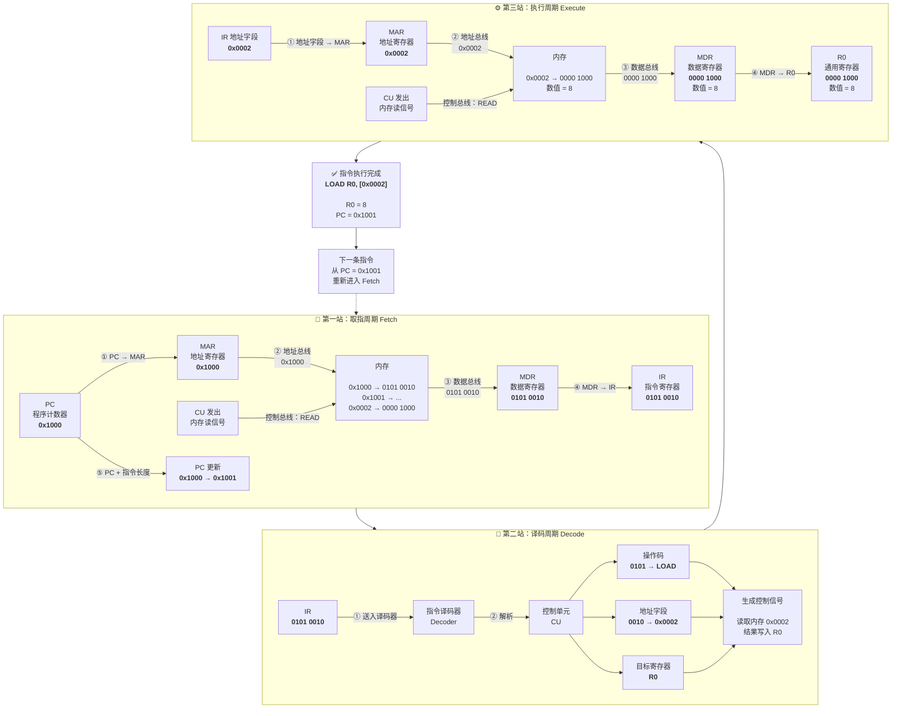

### 1.1.1 冯诺依曼结构

计算机由
- 运算器
- 控制器
- 存储器
- 输入设备
- 输出设备
组成；

指令和数据都以二进制形式存放在存储器中，按地址访问。

程序和数据**合并存储**在同一个存储器中，共享同一条总线进行传输。因此，CPU在任一时刻要么取指令，要么存取数据，采用**顺序执行**的方式

但其“**冯·诺依曼瓶颈**”是主要缺陷：由于指令和数据共享同一条总线，CPU和内存之间的数据傳輸速率远低于CPU的处理速度，成为制约性能的瓶颈

![[Pasted image 20260812111431.png]] 

CPU 主要包含 ALU、通用寄存器、PC、IR 和控制器；MAR/MDR 负责刻画主存地址与数据交换。关键不是“有五大部件”，而是**存储程序、按地址访问、指令顺序执行并可由转移指令改变控制流**。

- **MAR（Memory Address Register，内存地址寄存器）**：存放**即将访问的内存单元的地址**。它相当于你在快递柜上输入的"**柜门编号**"; 
- **MAR的位数** 决定了CPU的**寻址能力**（最大支持多少内存）。如果MAR是32位，最多能寻址 2³² 个内存单元（即4GB空间）。

- **MDR（Memory Data Register，内存数据寄存器）**：存放**从内存读取或即将写入内存的数据**,它相当于快递柜里那个被打开柜门中的"**包裹**";
- **MDR的位数** 通常等于CPU的**字长**（即数据总线的宽度，如32位或64位），决定了CPU一次能处理的数据量。

![[Pasted image 20260812112021.png]]

它们都是CPU内部的寄存器，直接参与了CPU的**取指（取指令）**和**访存（读写数据）**操作。

| 特性          | 程序计数器 (PC)        | 指令寄存器 (IR)         |
| ----------- | ----------------- | ------------------ |
| **存储内容**    | **下一条指令的地址**      | **当前正在执行的指令**      |
| **核心作用**    | 控制指令执行顺序（“导航”）    | 为指令译码和执行提供依据（“执行”） |
| **是否自动修改**  | **是**（取指后自动+1或跳转） | **否**（被新指令覆盖）      |
| **参与的总线**   | **地址总线**          | **数据总线**           |
| **对程序员可见性** | **是**（可通过指令修改）    | **否**（硬件自动控制）      |

PC、IR、MAR、MDR协同工作

### 哈佛结构：突破瓶颈的并行之道

为了解决冯·诺依曼结构的瓶颈，哈佛结构应运而生。

- **核心特点**：将**程序指令和数据**分别存储在**两个独立**的存储器中，并配备各自独立的总线。
- **主要优点**：CPU可以**同时**访问指令和数据，实现**并行操作**，大大提高了数据吞吐率。
- **典型应用**：广泛应用于对数据处理速度和实时性要求高的**嵌入式系统**和**数字信号处理器（DSP）** 中。

![[Pasted image 20260812111049.png]]

### 1.1.2 程序和指令的执行过程

程序是有序指令序列。典型指令周期包含取指、译码、取操作数、执行、写回，并更新 PC。异常或中断会暂时打断正常流程，保存必要状态后转入处理程序。