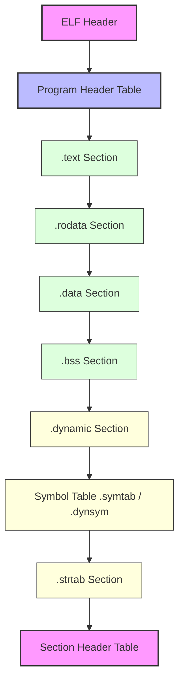

# 一、程序设计语言和翻译程序

机器语言可被 CPU 直接执行；汇编语言以助记符对应机器指令；高级语言通过编译或解释获得可执行语义。汇编器、编译器、解释器都是翻译程序，但输入输出与执行时机不同。

> **扩展内容：** 现代工具链常混合 AOT、JIT 与解释执行。LLVM IR、GCC GIMPLE、WebAssembly 等中间表示把前端语言与后端 ISA 解耦；JIT 还能依据运行时热点重新优化。

## **AOT（Ahead-Of-Time，提前编译）** 
指在**运行之前**直接将源代码编译成目标平台的机器码（二进制文件）。对于 **Rust、C、C++**，结论非常干脆：**它们生来就是纯粹的 AOT 语言**，没有主流“解释执行”或“JIT（即时编译）”模式

| 对比维度           | 传统 AOT（C/C++ 为代表）                                                     | 现代 AOT（Rust 为代表）                                           | JIT（Java/C# 为代表）                        |
| :------------- | :-------------------------------------------------------------------- | :--------------------------------------------------------- | :-------------------------------------- |
| **典型代表语言**     | C、C++                                                                 | Rust                                                       | Java、C#                                 |
| **编译与执行流程**    | 编译器（GCC/Clang）将源码→汇编→二进制机器码；链接后生成 `.exe`/`elf` 可执行文件，由操作系统加载器直接载入内存运行 | 整体流程与 C++ 类似，依赖 LLVM 后端生成机器码；编译期完成全部语义与安全检查，直接输出二进制可执行文件运行 | 源码先编译为平台无关字节码；运行时由 JIT 编译器边翻译边执行，存在预热过程 |
| **编译期核心工作**    | 语法检查、代码优化、机器码生成、链接                                                    | 除常规编译优化外，**借用检查、生命周期分析、泛型单态化**全部在编译期完成                     | 仅生成字节码，做少量静态检查；核心优化与机器码生成在运行期完成         |
| **运行时额外组件**    | 无额外编译器、解释器参与，运行时零开销                                                   | 无 GC、无虚拟机，运行时无额外编译环节                                       | 依赖 JIT 编译器与虚拟机（JVM/CLR），运行时持续参与执行       |
| **启动速度**       | 极快，无任何预热过程                                                            | 极快，无任何预热过程                                                 | 较慢，存在 JIT 编译预热阶段                        |
| **运行时内存占用**    | 极低                                                                    | 极低                                                         | 相对更高，需承载虚拟机与 JIT 机制                     |
| **跨 CPU 架构能力** | 不可跨架构通用，需针对目标架构重新编译                                                   | 不可跨架构通用，需针对目标架构重新编译                                        | 字节码可跨平台，由对应平台的虚拟机完成架构适配                 |

## **向量指令和标量指令**

就是 CPU 能够“**一条指令、同时操作多份数据**”的指令。

用学术黑话叫 **SIMD（Single Instruction, Multiple Data，单指令多数据流）**，而常规的“一次只算一个数”的指令叫**标量指令（SISD）**。向量指令就是专门用来驱动你上一轮问到的**向量寄存器**的。**向量寄存器**是 CPU 内部专门用来处理 **SIMD（单指令多数据流）** 的超宽寄存器

为了直观理解，我们看一个数学运算：`C[0..3] = A[0..3] + B[0..3]`

- **标量指令（传统方式）**：需要 4 条加法指令，分 4 次把数据从内存搬进通用寄存器，逐个相加，再逐个写回。
- **向量指令（SIMD 方式）**：只需要 **1 条加法指令**（如 x86 的 `vaddps`）。这条指令会一次性将 A 的 4 个值、B 的 4 个值分别载入两个 **256位向量寄存器**，在 CPU 内部并行计算，同时输出 4 个结果。    

**在 Rust / C / C++ 中，向量指令通常通过以下 3 种方式产生：**
1. **自动向量化（编译器默默帮你做）**：当你写了一个简单的 `for` 循环（如累加数组），GCC/LLVM 在开启优化（`-O2` / `-O3`）时，若检测到迭代次数固定且无数据依赖，会自动将标量循环编译成向量指令。你无需改代码，性能就上去了。
2. **手动 Intrinsics（精准控制）**：编译器提供内建函数（如 `_mm256_add_ps`），让你在 C/C++/Rust 中显式调用特定向量指令。这相当于“内联汇编的平替”，可读性稍好，且能精确指定使用 AVX2 还是 AVX-512。
3. **编程语言抽象（Rust 特有）**：Rust 的 `std::simd` 库（或第三方库 `wide`）提供了跨平台的 SIMD 类型，让你像操作普通切片一样写代码，编译后自动映射到目标平台的向量指令。

## LLVM
底层虚拟机(Low Level Virtual Machine)是一个**模块化、可重用的编译器基础设施（compiler infrastructure）项目**

LLVM 的精髓在于其**经典的三段式架构**，各模块可独立发展：
1. **前端（Frontend）**：负责将源代码（如 C、Rust、Swift）翻译成 LLVM 的“世界语”——**中间表示（IR）; 主要前端包括 **Clang** (C/C++/Obj-C) 和 **Rustc** (Rust) 等
2. **中间表示（IR）**：LLVM 的**核心与灵魂**。它是一种**强类型、低级别**的指令集，独立于任何源语言和目标机器。所有优化（如常量传播、死代码消除）都在这个层级进行
3. **后端（Backend）**：将优化后的 IR 翻译成特定 CPU（如 x86、ARM）的**目标机器码

此外，LLVM 还提供 **JIT（即时编译）** 能力，可在运行时将 IR 编译为机器码。

![[rustc-llvm.png]]

# 二、从源程序到可执行文件

## GCC/G++传统编译过程
![[GCC_G++_compile.png]]
C/C++有一个默认使用LLVM作为底层代码的生成平台的编译器——clang，它是LLVM项目中的一个子项目，主要负责C/C++ 词法、语法、类型检查等前端工作的编译器
## clang配套工具区分（LLVM 全家桶快速分清）

- `clang`：编译器
- `clang++`：C++ 编译器入口
- `clangd`：LSP 语言服务（编辑器用）
- `clang‑tidy`：静态代码检查工具
- `clang‑format`：代码格式化工具

# 三、可执行文件的启动和执行

## Linux、FreeBSD等like-unix系统广泛使用ELF(executable and linkable format)格式
ELF可以表示
- .o	可重定位目标文件
- .so	共享库
- 程序	可执行文件
- core	Core Dump
一个ELF文件大致为：

